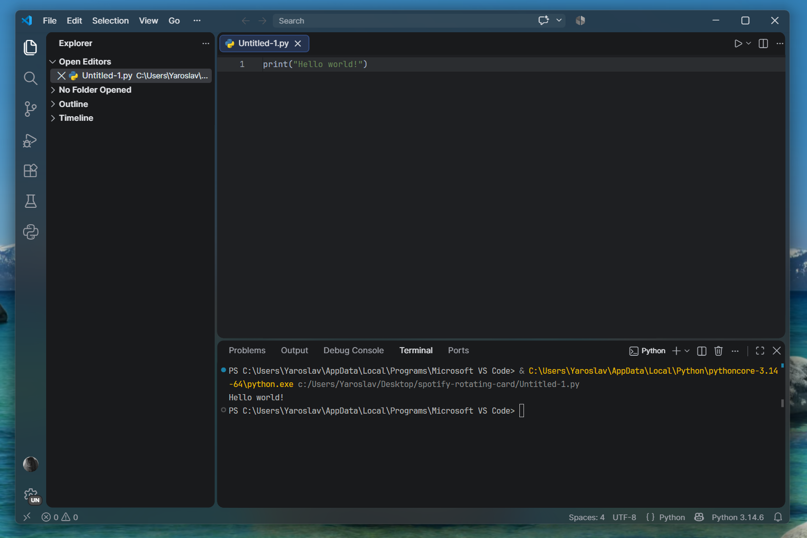
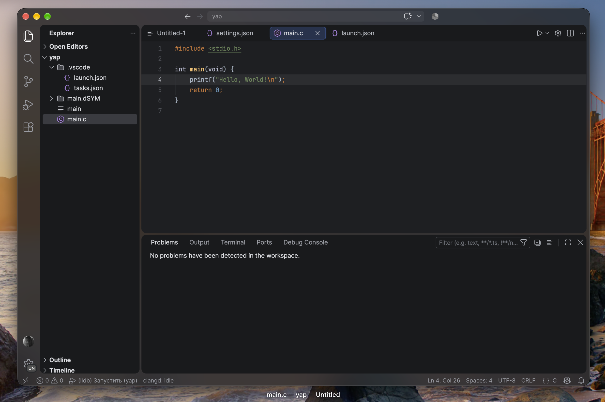

<div align="center">

# 🏝️ Flying Island

### Floating islands and real window glass for VS Code.

Rounded islands · native macOS / Windows 11 blur · Darcula Contrast theme · C/C++ highlighting via clangd.
No third-party tools — just one extension and an install script.
<br/>


<br>

<br/>

<br/>
<sub>Rounded islands · glass in the gaps · solid panels over the blur (Windows)</sub>
<br/><br/>
<br/>

<br/>
<sub>Rounded islands · glass in the gaps · solid panels over the blur (macOS)</sub>
<br/><br/>

**One-line install**

🪟 Windows — paste into PowerShell:

```powershell
iwr -useb https://raw.githubusercontent.com/am1dreaming/Flying-Island-dark-for-VS-code/main/install-web.ps1 | iex
```

🍎 macOS — paste into Terminal:

```bash
curl -fsSL https://raw.githubusercontent.com/am1dreaming/Flying-Island-dark-for-VS-code/main/install-web.sh | bash
```

<sub>

[✨ Features](#-features) | [⚡ Quick start](#-quick-start) | [⚙️ Settings](#️-settings) | [🧩 How it works](#-how-it-works) | [🩹 Troubleshooting](#-troubleshooting) | [🧹 Uninstall](#-uninstall)

</sub>

</div>

---


## ✨ Features

<table>
<tr>
<td width="50%" valign="top">

**🏝️ Floating islands**
- Explorer, editors, terminal and chat are separate rounded islands
- Every split editor group is an island of its own
- Gaps, corner radius and window-edge margins are configurable
- Pill-shaped active tab with an outline, like the JetBrains New UI

</td>
<td width="50%" valign="top">

**🪟 Real glass**
- macOS: native vibrancy (`under-window`, `sidebar`, `hud`)
- Windows 11: Acrylic, Mica or Tabbed
- The blur shows in the gaps, the title bar and the status bar
- Islands stay solid; glass opacity is adjustable

</td>
</tr>
<tr>
<td width="50%" valign="top">

**🎨 Flying Island Dark theme**
- Colors from the open-source IntelliJ Platform (Islands + Darcula Contrast)
- 371 UI colors, TextMate rules and semantic tokens
- C/C++: macros, fields and types told apart via clangd
- JetBrains Mono and Inter fonts included

</td>
<td width="50%" valign="top">

**⚙️ Just works**
- Re-applies itself after VS Code updates
- Installs into every VS Code profile at once
- Migrates settings from the old "Islands Dark" version
- **Remove All Patches** restores stock VS Code

</td>
</tr>
</table>

---

## ⚡ Quick start

**Option A — one line (recommended).**

Windows — in PowerShell:

```powershell
iwr -useb https://raw.githubusercontent.com/am1dreaming/Flying-Island-dark-for-VS-code/main/install-web.ps1 | iex
```

macOS — in Terminal:

```bash
curl -fsSL https://raw.githubusercontent.com/am1dreaming/Flying-Island-dark-for-VS-code/main/install-web.sh | bash
```

**Option B — from a downloaded copy.** Download the repo (**Code → Download ZIP**), unpack it and run from that folder:

```powershell
# Windows (PowerShell)
powershell -ExecutionPolicy Bypass -File .\install.ps1
```

```bash
# macOS (Terminal)
bash install.sh
```

The installer takes care of everything:

> Installs the **JetBrains Mono** and **Inter** fonts (current user only) · packs and installs the extension into every VS Code profile · installs **clangd** and the **JetBrains Icon Theme** pack · merges the theme settings into `settings.json` (your old one is kept as `settings.json.bak-islands`) · removes the old "Islands Dark (CLion)" extension if present. Re-running is safe.

When it finishes: **fully quit VS Code → open it again → click "Reload Window"** in the Flying Island notification. On Windows 11, VS Code asks for one more restart to turn the glass on. ✨

<details>
<summary><b>Install just the extension, without the script</b></summary>

1. Build the package: `python3 tools/pack_vsix.py` → you get `dist/flying-island-<version>.vsix`.
2. In VS Code: **Extensions → ⋯ → Install from VSIX…** and pick that file.
3. Select the **Flying Island Dark** theme (`Ctrl+K Ctrl+T`).
4. Run **Flying Island: Apply** and click **Reload Window**.

Fonts and settings are not installed this way.

</details>

---

## ⚙️ Settings

Everything lives under **Flying Island** in the VS Code settings. After a change the extension offers to reload the window.

**Island geometry** (in pixels):

| Setting | Default | What it sets |
|---|---|---|
| `flyingIsland.gap` | `4` (0–16) | gap between neighbouring islands |
| `flyingIsland.radius` | `10` (0–20) | corner radius |
| `flyingIsland.margin.top` | `0` (0–16) | space below the title bar |
| `flyingIsland.margin.right` | `7` (0–16) | space from the right window edge |
| `flyingIsland.margin.bottom` | `4` (0–6) | space above the status bar |
| `flyingIsland.margin.left` | `0` (0–16) | space from the activity bar on the left |

**Glass:**

| Setting | Values |
|---|---|
| `flyingIsland.vibrancy` | `off` · macOS: `under-window`, `sidebar`, `hud` · Windows 11: `acrylic`, `mica`, `tabbed` |
| `flyingIsland.vibrancyOpacity` | `0.3`–`1`, default `0.4` (lower = more glassy) |

> 💡 After changing the glass **material**, quit and reopen VS Code. After changing **opacity** or geometry, Reload Window is enough.

<details>
<summary><b>Your own colors on top of the theme</b></summary>

No rebuild needed — the standard VS Code settings work on top of the theme:

```jsonc
"workbench.colorCustomizations": {
  "[Flying Island Dark]": { "editor.background": "#1B1C1F" }
},
"editor.tokenColorCustomizations": {
  "[Flying Island Dark]": { "comments": "#7A7E85" }
},
"editor.semanticTokenColorCustomizations": {
  "[Flying Island Dark]": { "rules": { "macro": "#908B25" } }
}
```

</details>

---

## 🧩 How it works

VS Code supports neither islands nor window glass, so on startup the extension carefully extends two of VS Code's own files and makes sure the changes survive updates.

```
┌────────────────────┐           ┌─────────────────────────┐
│  Flying Island     │  styles   │  workbench.html          │  islands, gaps, radius,
│  extension.js      │ ────────▶ │  + css/islands.css       │  glass in the gaps
│  (on startup)      │           └─────────────────────────┘
│                    │  window   ┌─────────────────────────┐
│                    │ ────────▶ │  mainImpl.js             │  vibrancy (macOS)
└────────────────────┘           │  + window creation hook  │  acrylic / mica (Windows 11)
                                 └─────────────────────────┘
```

The glass material is stored in `~/.flying-island/vibrancy.json`, so switching it needs no re-patching. The original VS Code files are kept next to them with a `.bak-islands` suffix.

---

## 📦 Requirements

| | Windows | macOS |
|---|---|---|
| **VS Code** | User Installer (in `%LOCALAPPDATA%\Programs`) | in `/Applications` |
| **Glass** | Windows 11 22H2+, transparency effects on | "Reduce transparency" off |
| **To install** | nothing — just PowerShell | Xcode Command Line Tools (`xcode-select --install`) |
| **For C/C++** | a compiler (LLVM, MinGW or MSVC) | clangd from the Command Line Tools |

On Windows 10 the islands work; the window just stays solid.

---

## 🩹 Troubleshooting

<details>
<summary>No islands or rounded corners</summary>

- **Windows:** VS Code was installed with the System Installer into `Program Files`, where the extension can't write. Reinstall VS Code with the **User Installer**.
- **macOS:** VS Code runs from Downloads. macOS launches it from a read-only copy — drag VS Code into `/Applications`.
- Run **Flying Island: Apply** and check for an error message.

</details>

<details>
<summary>VS Code says "Your Code installation appears to be corrupt"</summary>

That's how VS Code reacts to any change to its own files — it's expected. Hide the notification with the gear button.

</details>

<details>
<summary>The glass is grey or missing</summary>

- **Windows:** turn on "Settings → Personalization → Colors → Transparency effects".
- **macOS:** turn off "Accessibility → Display → Reduce transparency".
- After changing the material, **fully quit** VS Code and open it again.
- Tools like MicaForEveryone conflict with the extension — add `Code.exe` to their exclusions.

</details>

<details>
<summary>Everything is gone after a VS Code update</summary>

An update replaces VS Code's files. The extension re-applies the patch on the next start and offers to reload the window — just click the button in the notification.

</details>

<details>
<summary>Styles break together with other extensions</summary>

**Custom CSS and JS Loader** and **Apc Customize UI++** also modify `workbench.html`. Don't use them together with Flying Island.

</details>

<details>
<summary>On Windows, clangd looks for <code>/usr/bin/clangd</code></summary>

That setting came over from a Mac via Settings Sync. Remove the `"clangd.path"` line from your Windows settings.

</details>

---

## 🧹 Uninstall

1. In VS Code run **Flying Island: Remove All Patches** and restart VS Code.
2. Restore your settings from the backup and remove the extension:

```bash
# macOS (on Windows the file is in %APPDATA%\Code\User\)
cp ~/Library/Application\ Support/Code/User/settings.json.bak-islands ~/Library/Application\ Support/Code/User/settings.json
code --uninstall-extension yaroslav.flying-island
```

Fonts, clangd and the icon pack stay installed — remove them separately if you like.

---

## 📁 Project structure

```
flying-island/
├── install.ps1 · install.sh          installer (Windows / macOS)
├── install-web.ps1 · install-web.sh  one-line install: downloads the repo and runs the installer
├── extension.js                      patcher: islands + glass, migration from the old version
├── package.json                      extension manifest and settings
├── css/
│   ├── islands.css                   island geometry
│   └── vibrancy.css                  translucent window chrome over the blur
├── themes/
│   └── flying-island-dark-color-theme.json   prebuilt color theme
├── settings/settings.jsonc           settings the installer merges in
├── fonts/                            JetBrains Mono, Inter + OFL license texts
├── tools/pack_vsix.py                packs a .vsix without node/vsce
└── LICENSE · NOTICE · licenses/      licenses and attribution
```

## ⚖️ Licenses

Project code is **MIT** (`LICENSE`). Theme colors are derived from [IntelliJ Community](https://github.com/JetBrains/intellij-community) (Apache 2.0); the fonts are distributed under **SIL OFL 1.1**. Details in `NOTICE`.

---

<div align="center">

**Flying Island** — made with 🩵 by **Yaroslav**

<sub>MIT License · not affiliated with or endorsed by JetBrains or Microsoft</sub>

⭐ *If you like it, star the repo.*

</div>
